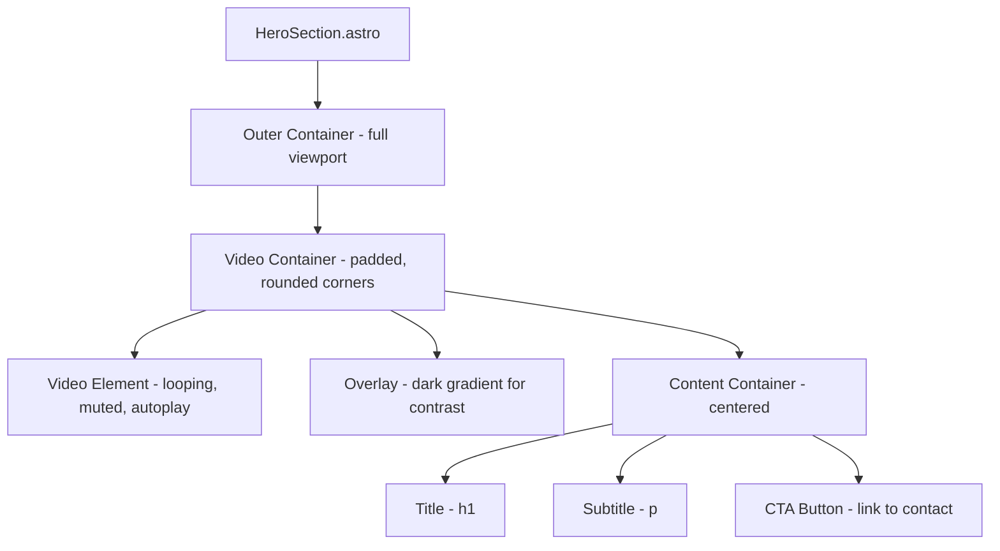

# Hero Section with Background Video - Design Plan

## Overview

This document outlines the design and implementation plan for a full-viewport hero section with a looping background video, optimized for accessibility and responsive across all devices.

## Design Direction

**Aesthetic**: Modern, minimalist, and light

- Clean typography with generous whitespace
- Subtle animations that enhance rather than distract
- High contrast for accessibility
- Refined, professional appearance

## Component Architecture

```
src/
├── components/
│   └── HeroSection.astro      # Main hero component
└── styles/
    └── global.css             # Extended with hero-specific utilities
```

## Component Structure



## Detailed Implementation

### 1. HTML Structure

```html
<section class="hero-section" aria-label="Hero">
  <div class="hero-video-container">
    <!-- Background Video -->
    <video
      class="hero-video"
      autoplay
      muted
      loop
      playsinline
      poster="/images/hero-poster.jpg"
      aria-hidden="true"
    >
      <source src="VIDEO_URL" type="video/mp4" />
    </video>

    <!-- Dark Overlay for Contrast -->
    <div class="hero-overlay" aria-hidden="true"></div>

    <!-- Content -->
    <div class="hero-content">
      <h1 class="hero-title">Your Title Here</h1>
      <p class="hero-subtitle">Your compelling subtitle that captures attention</p>
      <a href="#" class="hero-cta"> Get in Touch </a>
    </div>
  </div>
</section>
```

### 2. CSS Styling Strategy

#### Outer Container

- Full viewport width and height: `min-h-screen w-full`
- Flexbox centering for content
- Overflow hidden to contain rounded corners

#### Video Container

- Full width/height with padding: `p-4 md:p-6 lg:p-8`
- Rounded corners: `rounded-2xl md:rounded-3xl lg:rounded-[2rem]`
- Relative positioning for overlay and content
- Overflow hidden

#### Video Element

- Absolute positioning to fill container
- Object-fit cover for proper scaling
- Centered with transform

#### Overlay

- Dark gradient overlay: `bg-gradient-to-b from-black/40 via-black/50 to-black/60`
- Ensures text contrast ratio of at least 4.5:1 (WCAG AA)
- Optional: subtle noise texture for depth

#### Content

- Z-index above video and overlay
- Text color: white for maximum contrast
- Centered with max-width constraint

### 3. Responsive Breakpoints

| Breakpoint          | Padding | Font Sizes                      | Rounded Corners |
| ------------------- | ------- | ------------------------------- | --------------- |
| Mobile (<640px)     | 1rem    | Title: 2rem, Subtitle: 1rem     | 1rem            |
| Tablet (640-1024px) | 1.5rem  | Title: 3rem, Subtitle: 1.25rem  | 1.5rem          |
| Desktop (>1024px)   | 2rem    | Title: 4.5rem, Subtitle: 1.5rem | 2rem            |

### 4. Accessibility Features

1. **Contrast**: Dark overlay ensures text contrast ratio ≥ 4.5:1
2. **Reduced Motion**: Respects `prefers-reduced-motion` media query
3. **ARIA Labels**: Proper labeling for screen readers
4. **Video Controls**: Video is decorative (aria-hidden), no controls needed
5. **Focus States**: Visible focus rings on CTA button
6. **Semantic HTML**: Proper heading hierarchy (h1 for title)

### 5. GSAP Animations

```javascript
// Entrance animation timeline
const heroTimeline = gsap.timeline();

// Staggered content reveal
heroTimeline
  .from(".hero-title", {
    opacity: 0,
    y: 60,
    duration: 1,
    ease: "power3.out"
  })
  .from(
    ".hero-subtitle",
    {
      opacity: 0,
      y: 40,
      duration: 0.8,
      ease: "power3.out"
    },
    "-=0.6"
  )
  .from(
    ".hero-cta",
    {
      opacity: 0,
      y: 30,
      duration: 0.6,
      ease: "power3.out"
    },
    "-=0.4"
  );

// Respect reduced motion preference
if (window.matchMedia("(prefers-reduced-motion: reduce)").matches) {
  heroTimeline.progress(1); // Skip to end state
}
```

### 6. Component Props Interface

```typescript
interface HeroSectionProps {
  // Content
  title: string; // Main headline
  subtitle: string; // Supporting text
  ctaText: string; // Button text
  ctaHref: string; // Button link (default: '#')

  // Video
  videoSrc: string; // Video URL (required)
  videoPoster?: string; // Poster image URL

  // Styling
  overlayOpacity?: number; // 0-1, default: 0.5
  borderRadius?: string; // Tailwind class, default: 'rounded-3xl'

  // Animation
  animate?: boolean; // Enable GSAP animations, default: true
}
```

## Visual Mockup

```
┌─────────────────────────────────────────────────────────────┐
│                                                             │
│   ┌─────────────────────────────────────────────────────┐   │
│   │                                                     │   │
│   │                 ▓▓▓▓▓▓▓▓▓▓▓▓▓▓▓▓                   │   │
│   │              ▓▓▓▓▓▓▓▓▓▓▓▓▓▓▓▓▓▓▓▓▓                │   │
│   │            ▓▓▓▓▓▓▓▓▓▓▓▓▓▓▓▓▓▓▓▓▓▓▓▓              │   │
│   │                                                     │   │
│   │              Your Title Here                        │   │
│   │                                                     │   │
│   │      Your compelling subtitle that                  │   │
│   │          captures attention                         │   │
│   │                                                     │   │
│   │              [ Get in Touch ]                       │   │
│   │                                                     │   │
│   │            ▓▓▓▓▓▓▓▓▓▓▓▓▓▓▓▓▓▓▓▓▓▓▓▓              │   │
│   │              ▓▓▓▓▓▓▓▓▓▓▓▓▓▓▓▓▓▓▓▓▓                │   │
│   │                 ▓▓▓▓▓▓▓▓▓▓▓▓▓▓▓▓                   │   │
│   │                                                     │   │
│   └─────────────────────────────────────────────────────┘   │
│                                                             │
└─────────────────────────────────────────────────────────────┘

Legend:
- Outer box: Full viewport
- Inner box: Video container with padding and rounded corners
- ▓▓: Video content (looping background)
- Text: White, high contrast over dark overlay
```

## Implementation Steps

1. **Create Component File**: `src/components/HeroSection.astro`
2. **Add Base Styles**: Tailwind classes for layout and responsiveness
3. **Implement Video Background**: With autoplay, mute, loop attributes
4. **Add Overlay**: Gradient overlay for text contrast
5. **Style Content**: Typography and button styling
6. **Add Animations**: GSAP entrance animations with reduced motion support
7. **Test Accessibility**: Verify contrast ratios and screen reader compatibility
8. **Test Responsiveness**: Verify on mobile, tablet, and desktop viewports

## Placeholder Video Source

For development, use a free stock video from sources like:

- Pexels Videos: https://www.pexels.com/videos/
- Coverr: https://coverr.co/
- Sample: `https://cdn.coverr.co/videos/coverr-aerial-view-of-a-forest-1234.mp4`

## Notes

- Video should be optimized for web (compressed, appropriate resolution)
- Consider providing multiple formats (mp4, webm) for browser compatibility
- Poster image should match video first frame for smooth loading experience
- Mobile devices may require different video handling for bandwidth considerations
